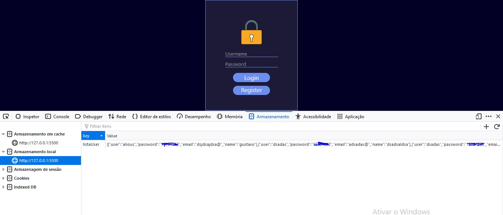
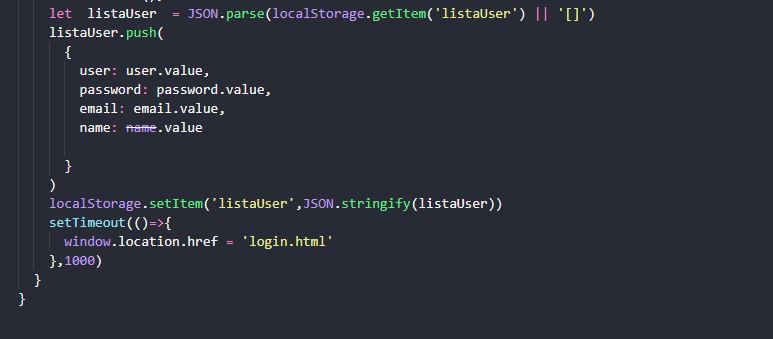

I made this project of Login and Register validation, to replace the backend i used the LocalStorage. 
 

Technologies:
HTML5 and CSS:Front-end and style 
JAVASCRIPT:Backend,front-end and styel.
Project challenges: 
 
 
The most dificult of this project is to implement the loalStorage and get the informations 

